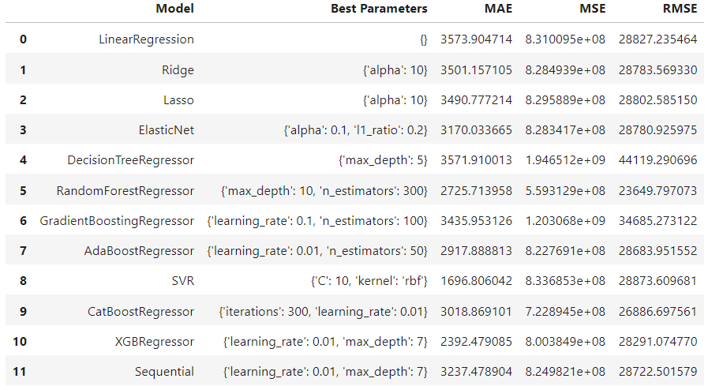

# Internship Studio internship

## About
Internship Studio is a platform developed to help students build their profiles by providing them the right exposure to develop the required skills in the respective domain. Log in to learning and devour upon the technical and organizational aspects of the corporate. Internship Studio provides an industry exposure within your domestic vicinity.

# Project : Youtube adview Prediction

## Context :

Youtube advertisers pay content creators based on adviews and clicks for the
goods and services being marketed. They want to estimate the adview based
on other metrics like comments, likes etc. The problem statement is therefore
to train various regression models and choose the best one to predict the
number of adviews. The data needs to be refined and cleaned before feeding
in the algorithms for better results.

# Attribute Information
'vidid' : Unique Identification ID for each video
'adview' : The number of adviews for each video
'views' : The number of unique views for each video
'likes' : The number of likes for each video
'dislikes' : The number of likes for each video
'comment' : The number of unique comments for each video
'published' : The data of uploading the video
'duration' : The duration of the video (in min. and seconds)
'category' : Category niche of each of the video

# Objective
To build a machine learning regression to predict youtube adview count based
on other youtube metrics.

# Results

# Choosing the best model

I have choosen RandomForestRegressor, because RandomForestRegressor is a popular machine learning model used for regression tasks. It is an ensemble model that combines multiple decision trees to make predictions. Each tree in the forest is trained on a random subset of the data and features, resulting in a diverse set of predictors.

In our specific case, the RandomForestRegressor model with the chosen parameters (max_depth: 10, n_estimators: 300) yielded the following results:

    MAE: 2725.71395829414
    MSE: 559312901.5829275
    RMSE: 23649.797072764228

The RMSE value of 23649.797072764228 indicates the average difference between the predicted values and the actual values. Lower values of RMSE indicate better model performance, as it signifies that the predictions are closer to the true values.

